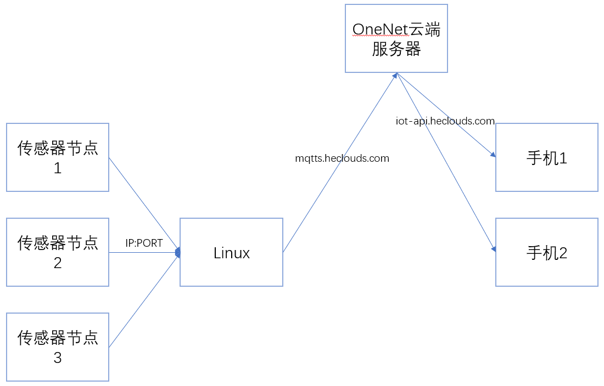

# 比赛内容说明

本文档针对**2023年第六届-全国大学生嵌入式芯片与系统设计竞赛应用赛道-龙芯中科技术股份有限公司命题-选题方向5：工业无线物联网传感系统**。

截止撰文时间2023年09月08日，本作品已获奖：*2023年（第六届）全国大学生嵌入式芯片与系统设计竞赛南部分赛区“二等奖*，项目名称为*工业物联网节点传感系统*，队伍ID为14897，队名为*人形编译器斯哈斯哈*（溜）。

# 本页关键词

- 致谢
- 赛题内容
- 作品框架
- 目录

# 致谢（滑跪）

从时间先后来说，非常感谢陈老师记得我大四的时候跟他提过研究龙芯的想法，当比赛举办时，龙芯官方人员先联系上农老师，陈老师听到龙芯之后便来问我的意愿，即使过了这么久，我依然对芯片保持着好奇心，我立刻选择参加了该比赛，并规划了三个月内的各个时间节点，这样的规划习惯同样感谢陈老师在我给实验室担任助理期间教给我的习惯（磕），之后就得感谢我的前室友”神“，他在工程应用实践课程的时候几乎是带我们寝室完成了``Linux``系统的监控功能，同时把相关的代码保存的非常完善，并且还得靠他在大三开始时期带我参加EDA竞赛并成功去到南京拿了二等奖（虽然是我邀请他参加，但是他带我完成了比赛，磕！），这样的比赛经历使我对”比赛“不再抱有距离感，我把后来参加嵌入式比赛也视为将”神“当年的”神迹“复制的一次大好机会。同样感谢前室友”波“，他愿意听我唠叨比赛内容（我曾邀请他），也愿意给我提出大胆的想法，我比赛作品的一个环节的确是受他启发（磕）。感谢少旭老师手把手、非常非常耐心、甚至是在周末教我使用电烙铁（尤其是刀头）和热风枪，这对于已经四年未焊接的我来说是非常好的复健课，也感谢少旭在电路设计方面提给我提供的指导；感谢山哥大清早来实验室替我开门（哭）；感谢杰哥开着小电瓶带我去食堂、带我去赶末班车、替我拿球拍（泪）；感谢志浩他们带我打三国杀（狗头）；上述老师和师兄在比赛初期给了我很多很多的帮助，我自己会的东西实在是很少，即使我早上7点坐车过去实验室学习也根本不够用，亲手用电烙铁一个元件一个元件的焊非常非常耗时，对新手本来就很不友好，下午只能待到18点，第一天自己焊的时候，花一整天只能焊一块板子（我自己设计也有问题），眼睛肯定是顶不住的，十分感谢他们在初期给了我充足的帮助。后来我尝试自己在实验楼下公共实验室里焊接，这就更加感谢利老师教我用加热台，学会这个东西之后10分钟就能出一块板子了，非常有用，虽然有些东西仍然只能自己用电烙铁焊，但这无疑给了我巨大的便利。在线上也感谢佳豪和金东时不时给点远程指导，凡哥因为完全把我忘了这次反而要扣分（狗头）。之后就还是得感谢陈老师让我在实验室学习一年左右的时间，我能对``linux``有一些了解，然后把相关的知识应用到其他地方。这次比赛其实难度真的不算很大，比赛用到的每个部分都是我在以前的学习过程中已经学过了的，比赛的目的同样也是为了把学过的知识活用起来，比如说会``arm``平台和``x86``平台，那在``loongarch64``平台也能继续适用，没有无线网卡就用有线网卡实现``VNC``，``ESP``和``STM32``都是单片机，小熊派上会用``mqtt``，那``ESP``也会，会一个就会另一个，``Socket``和``TCP``是在陈老师主导的工程应用实践课程上学的，树莓派是该课程上使用的，由家里哥哥送给我的（跪），比赛作品的很大一个坎都是通过树莓派去贯通到龙芯派上的，这个坎是本次比赛唯一的知识盲区：``sysroot``。非常感谢给我提供或多或少帮助的老师和同学，也感谢给我加油的家人，唯一的遗憾是没能去厦门大学参加线下比赛（被台风影响了）。

# 题目

官方文档给出的实现思路：

1. 基本思路
   - 完成至少三个的节点设计，能实现环境温度、湿度、光强数据实时采集并显示出来。
   - 完成终端的设计，具备以下功能：
     1. 全部的终端操作应在图形化的GUI上实现
     2. 能够分别查看每个节点的每项传感数据
     3. 能够查看每个数据系统时间变化的波形图，数据上报间隔不大于3秒
   - 节点与终端采用无线连接如WiFi、zigbee等，终端能够实时查看每个节点的在线情况以及上线、下线日志。掉线和上线测试的反应不超过3秒
   - 终端能对多节点的数据进行分析，实时发现温度、湿度、光照异常的节点，并在终端上报警
   - 终端可以将节点数据上传到云端，可使用现成的物联网云平台，如阿里云、OneNET等，也可以自己搭建，可以远程在手机或者电脑上查看节点数据。终端的所有报警信息可以以短信、邮件等形式实时发送到手机
2. 拓展发挥部分
   - 节点采用锂电池供电，且具有充电管理功能，能够使用USB进行充电。节点能上报自身的电量并在终端显示出来，低电量时在终端报警
   - 自行设计节点的PCB并完成打板，PCB上印刷”龙芯配套工业无线物联网节点“字样
   - 终端能将传感数据与时间对应关系保存成txt或excel等格式并导出文件
   - 系统采用一体化设计，布线合理、标识清晰、外观整洁、界面优美
   - 设计报告包含方案部分的方案描述、比较与选择、系统相关参数设计、系统组成、原理框图与各部分电路图、系统软件与流程图、测试方案、测试结果完整性和测试结果分析，行文规范、结构严谨
3. 说明
   - 节点不允许使用市售现有产品
   - 节点的MCU可以自行选择，可使用自带无线的MCU或者普通MCU加无线模块，尽量使用低成本和低功耗方案
   - 节点数据异常是指某个节点的传感器数值和其他的节点相比过高或者过低，以及如火灾、进水等传感器数据异常报警
   - 手动开关节点模拟测试上下线的功能，更换不同电量的电池测试电量检测上报功能
   - 远程查看数据是指通过云端以互联网进行数据查看而非本地连接，自行搭建物联网服务器也需要能够远程访问
   - 自行绘制的PCB尽量使用基本的元器件而不是对现成的模块进行整合

## 框图

### 框图说明

本文档的说明内容即框图所示通信系统，众多传感器的数据信息从传感器节点通过WiFi传输到中心系统板上，系统板通过连接MQTT物联网云服务器，将传感器信息上传到云端服务器（此处为OneNet平台），然后手机通过云端服务器的API获取中心系统板上传的数据，即完成了赛题需求。

之后的内容将围绕框图内容展开更加详细的说明。

# 目录

[1.0 demo](./demo/Readme.md)

- [1.1 关于ESP](./demo/关于ESP/Readme.md)
- [1.2 关于立创EDA](./demo/关于立创EDA/Readme.md)
- [1.3 关于焊接仪器](./demo/关于焊接仪器/Readme.md)
- [1.4 关于龙芯派](./demo/关于龙芯派/Readme.md)
- [1.5 关于Qt](./demo/关于Qt/Readme.md)
- [1.6 关于内网通信](./demo/关于内网通信/Readme.md)
- [1.7 关于OneNET](./demo/关于OneNET/Readme.md)
- [1.8 关于手机端](./demo/关于手机端/Readme.md)

[2.0 TroubleShooting](./addition/1.TroubleShooting/Readme.md)

[2.1 ProgramBesides](./addition/2.ProgramBesides/Readme.md)

