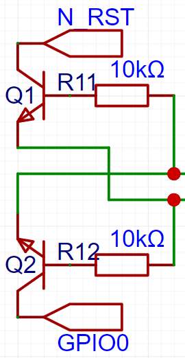

# 说明

本文为比赛作品在选型初期、开发中期及比赛后期中遇到的问题集。

## arduino内使用8266

工具-开发板-esp8266-NodeMCU1.0（ESP-12E Module）

文件-示例-01.Basics-Blink，闪烁片上蓝灯

- setup：LED_BUILTIN配置为输出
- loop：用digitalWrite控制针脚为高低，写低点亮

## 绘制esp8266辅助电路

- CH340C不用外部晶振即可起振
- 自动下载电路的EN可能休要修改为N_RST
- IO2在开发板启动时不能拉低
- IO15在运行中应永远拉低
- IO0在上电时拉高为运行模式，上电时拉低为下载模式
- IO0~15都内置上拉，16内置下拉
- IO1，3是一组串口，IO2，8是另一组串口，8已经用于连接flash
- 无硬件iic，data sheet说IO2为SDA，14为SCL
- 硬件SPI：IO14为CLK，12为MISO，13为MOSI，15为CS（SS）

## ESP8266WebServer.h

connect建立连接并发送HTTP请求，ESP不会立刻收到服务器响应，原因可能是：

1. 服务器收到了多个请求
2. 对ESP的响应可能会延迟
3. 网络固有延迟

```cpp
esp8266_server(80);
on("/",HTTP_GET,handleRoot);
on("/LED",HTTP_POST,handleLED);

httpClient.begin(URL);
int httpCode=httpClient.GET();
httpClient.getString();
httpClient.end();

client.connect(host,httpPort);
client.print(httpRequest);
client.connected()||client.available();
client.readStringUntil('\n');
client.stop();
```


## ESP8266WiFi.h

```cpp
port
ssid
pssword
115200
pinMode(,INPUT_PULLUP);
mode(STA);
begin();
ReadLine();
readAll()；
write();
waitForBytesWritten();
```

## 看门狗与软复位

ESP存在自动重启（Soft WDT reset）的故障问题，直接看该问题的话，是长时间没有喂狗导致看门狗复位，例如长时间在loop中执行某个函数，可能会导致该问题，但实际上问题通常不是看门狗的问题，因为很多库都会自己喂狗，不需要我们来喂，问题通常出现在其他地方，这个时候就别依靠搜素引擎了。

## 芯片方案

刚拿到赛题时，我根本没听说过ESP这种东西，就想着能不能用STM32实现，我就去疯狂找正点原子的各种资料包，芯片选型，像什么STM32L431RCT6、STM32F103C8T6、ESP32、CC2530作为主控的，AMS1117-3.3稳压，STM32F103C8T6作为ST-LINK V2的主控，DC-DC Power电路，AT24C04作为存储芯片，还抄了好几版的核心板电路，问了很多同学，电子的、通工的、微电的，他们有的上过相关设计课程，有的经常性的参加电子设计竞赛，但是问下来的结果都是，没怎么自己去设计和焊接过这种东西，问到这的时候我心里就已经爆炸了，坏了，那我该怎么着手呢？然后就想起大三上那个工程实践时听过立创的赛题（但我和亲爱的舍友没有选那个方向的题），我就想着，反正都是画板子的，proteus、AD、立创EDA，哪个简单用哪个吧，先去捣鼓捣鼓，然后就翻到立创EDA的开源社区去了，结果一打开社区，到处都是ESP，非常炫酷的很多东西都映入眼帘了，我就随便找了一下“核心板”的搜索结果，出来一个ESP-12F，然后就去抄别人的电路图，后来了解到，它的内部其实还有IC和FLASH，但是它由ESP8266封装之后称为ESP-12F，还有12S，于是我就开始去操作ESP-12F的核心板了，虽然失败了八版，在北京出差的时候也去请教了20年经验的老师傅，老师傅非常认可我失败8版（每版5片板子）之后还能继续钻研的精神，给我提供了许多思路，所以之后我想我还是会继续去测试ESP的芯片方案。

ESP8266内置了TCP/IP协议栈，可以通过AT指令、Lua脚本进行编程，是提供了“单芯片”解决方案的IoT MCU，还实现了中小型RF协议栈，在物理层、顶层应用之间平均分配内存，其他的方案通常可能是“主处理器+WiFi模块”的分离式方案；

现在常见的WiFi6 IoT芯片还有ESP32-C6（RISC-V SoC 32-bit，支持802.11ax/b/g/n）、高通318（A53）、BL602/604（RISC-V 32-bit）、BK7231U、WGM160（ARM M4）、88MW320/322（ARM M4F）、V5663（ARM M33或ARMv8 M）、LN882X（ARM M4F）

### CH340

自动下载电路依靠CH340的DTR、RTS实现，DTR用于控制VCC向VDD供电的电源开关，N_RST通常是芯片的EN脚，该脚一般会接一个RC电路上拉，电阻可以是10k，电容可以是1uF或者10uF，两个三极管不做额外说明了，可自行搜索相关帖子。

 

## WiFi中继器/WiFi NAT路由器

当ESP8266设置为STA+softAP时可以视为NAT

STA指通常的手机、电脑，连接其他网络的终端

SoftAP指软件模拟的或者实际硬件的无线接入点，通常是无线路由器、无线桥接器

校园网是WPA2企业网络