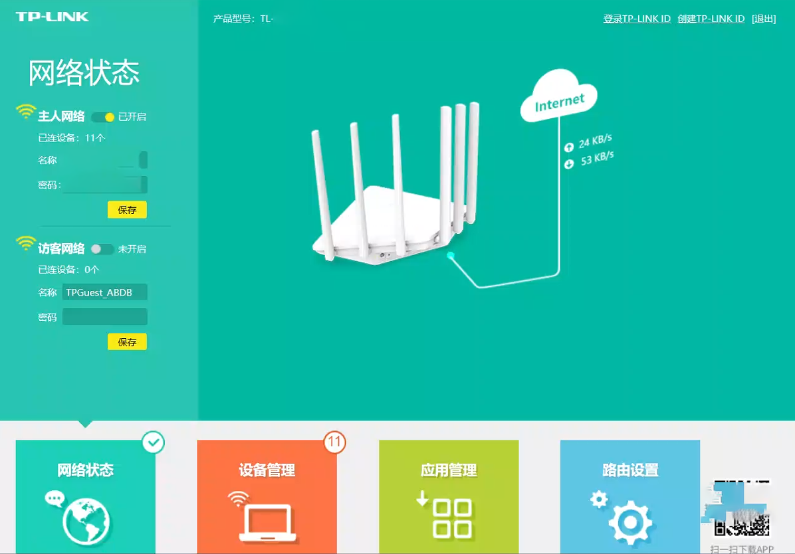

# 说明

## 是什么

人话：路由器是带天线那种盒子，不是光猫，光猫接的是光纤，路由器插的是水晶头（RJ-45），目前只见过服务器背后可以直接插双纤光纤的，还有直接插光纤的交换机，没见过插光纤的路由器。

官话：路由器（Router）是连接两个或多个网络的硬件设备，在网络间起网关的作用，是读取每一个数据包中的地址然后决定如何传送的专用智能性的网络设备。它能够理解不同的协议，例如某个局域网使用的以太网协议，因特网使用的TCP/IP协议。这样，路由器可以分析各种不同类型网络传来的数据包的目的地址，把非TCP/IP网络的地址转换成TCP/IP地址，或者反之；再根据选定的路由算法把各数据包按最佳路线传送到指定位置。所以路由器可以把非TCP/IP网络连接到因特网上。

唠叨：路由器这种东西能骗人的点其实太多太多了，而且这个东西的概念本身还比较古老，产品迭代其实很慢的，但是人们喜欢新东西，喜欢缺少约束的新东西，那就开始骗人就行了，反正人是自愿被骗的。

## 怎么做

人话：路由器是可以人工配置的，以TP-Link的路由器为例

首先，你得知道打开路由器后台的依据，路由器后台的打开方式由网关地址决定，查询网关地址的方法是用ipconfig或ifconfig工具，输入这个指令的地方需要自行打开，打开方式是（windows）Win+R键后出来一个小窗口，在小窗口里输入cmd，就可以打开``C:\Windows\system32\cmd.exe``这个可执行文件了，然后在这个命令行窗口中输入ipconfig，就会弹出网络配置。

通常会弹出电脑上的所有网络适配器，如以太网适配器（ETH）、无线局域网适配器（WLAN），然后这些适配器后边会跟一些信息，如DNS、IPv6、IPv4、子网掩码（netmask）、默认网关，其中与锁定路由器有关的词条是默认网关，它通常是``192.168.1.1``或``192.168.0.1``，而IPv4通常是修改最后以为数字，子网掩码通常都是``255.255.255.0``，它意思是：针对0这个位置，IPv4会变化，而255的对应的位置，IPv4是不会变的，与网关保持一致。假设我们的网关是``192.168.1.1``，那就打开浏览器，在网址栏输入``192.168.1.1``，就会出现路由器后台界面，并且很多时候会要求我们输入管理员密码，这个也很多时候都是默认密码，什么1234567890，如果办理业务的人不知道的话可以试一试，试多了会锁上（好像大概会），这里我视为已成功输入密码。

其他路由器只是UI界面不一样，但是功能都一样的。例如在企业网络中可以通过路由器的端口映射功能完成内网穿透，这样你就可以在企业网络的任何位置连上某个路由器下的电脑，延迟极低，与通过公网连接的远程桌面有质的区别，当然这个功能在家庭中一般没用，因为小区的交换机一般会把光猫作为一个局域网，然后你的路由器本身再局域一次，你的环境中不存在多个路由器了，除非你一个光猫接多个路由器（你家很大你就可以这样），然后做网桥（NAT还是桥接我忘了），你就能用到端口映射。这个端口映射和内网穿透功能会被不同的厂商冠以不同的名字，需要靠经验值去自己翻出来并设置映射。

上文提的内容是我觉得我学到的比较罕见的知识，接下来我介绍一下一些常见的知识。

路由器自带DHCP服务器功能，这个功能很重要，我们打开手机-设置-WLAN-打开已经连接的WiFI详情，下面会出现很多信息，有一个IP地址，例如我的小米手机，在MIUI中，系统把IPv4给关闭了，IP地址那个位置就只显示了IPv6，这个IPv6就是由路由器中的软件DHCP服务器来实现的动态IP分配功能。对路由器来说，它每隔2小时就会调整连接它的设备的IP地址（从设备连接路由器的WLAN起的2小时），路由器通过手机网卡的唯一MAC地址来辨识设备，通过IP地址来完成网络通信，因此动态IP成为了可能，这可能会有效地保护一个局域网中的长时间连接设备，防止设备被通过IP进行攻击；这也可能会让IP资源变得灵活，因为IP是有限的，如``192.168.1.2``，一个路由器下最多有255个ip地址，其中1为网关，剩下254个，有时候路由器的某个ip会被占用，那么这个ip可能本来已经被某个设备使用过了，那么下一次这个设备连接时可能仍会申请上次使用过的IP，但在设备未连接期间有功能占用了这个ip，DHCP服务器就会给设备换一个ip地址继续上网。

对于已经提到的内容，

官话：

唠叨：

## 补充

