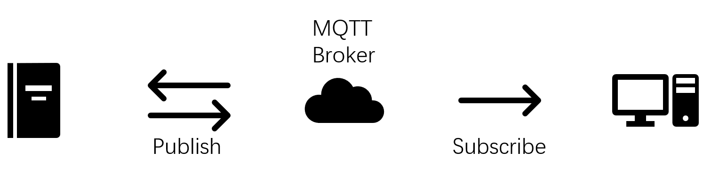
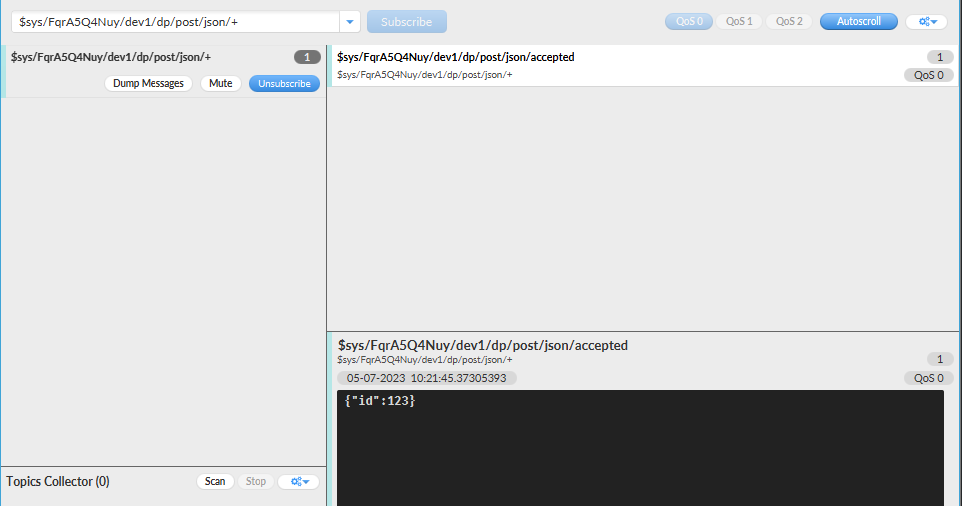
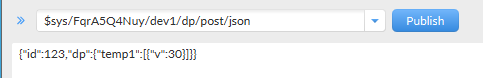

# 说明

## 是什么

人话：10086建的免费物联网平台，在上边注册时候就能免费拥有一个MQTT服务器。

官话：OneNET是NB-IOT套件、MQTT套件、OneNET Studio、和物生活物联网平台统一融合，构筑统一平台入口、统一业务流程、统一平台数据的一站式物联网开放平台。

唠叨：平台挺多的，阿里云、华为云都可以用做MQTT服务器吧，但是配置方式全都不一样，我曾因为OneNET搞不下去了想换平台，但是换了之后吃了更多闭门羹，就回到OneNET了，没其他原因，就是因为我接触OneNET时间长一点才用的OneNET。

## 怎么做

人话：OneNet官网网址：[OneNET - 中国移动物联网开放平台 (10086.cn)](https://open.iot.10086.cn/)，去注册一个平台账号，然后就开始复杂起来了。

1. 在已登录的情况下回到上述链接界面，可以看到右上角由登录变为**开发者中心**，进入该界面可以看到左侧包含：**平台概览，产品开发，设备接入管理，数据流转，运维监控，增值服务**，本次配置MQTT云端服务器完全无需了解最后两项，即全免费。可以在之前的MQTT客户端看到，登录OneNet平台的云端服务器是需要一些参数的，现在开始从产品开发操作界面获取相关参数。

2. 点击左侧**产品开发-创建产品**，选择产品品类随意，选择智能化方式选择设备接入，不选择产品智能化；产品名称尽量短、尽量用英文，所属地市随意，节点类型选择直连设备，接入协议选择MQTT，数据协议选择**数据流**，联网方式选择**其他**，开发方案选择自定义方案，剩余信息可不填，点击确定。在**我的产品**中看到刚才生成的产品，MQTT客户端首先需要的是产品名称下的**产品ID**，此时开发状态为**开发中**（最终应当为**已发布**），点击右侧**操作**下的**设备管理**，跳转到**设备接入管理-设备管理**下，点击添加设备，所属产品不变，设备名称自行设定，要求简明扼要，设备名称就是MQTT客户端需要的第二个参数，应当为英文，其余信息随意。此时已在设备列表中生成了一个设备，设备状态为**未激活**（最终应当为**离线**或**在线**）。返回**产品开发**，点击右侧**操作-产品开发**，数据流模板-创建模板，数据流名称无所谓，按照要求任意取名，向下滑动网页，点击下一步，出现**设备开发，Topic管理，远程配置，自动注册设备**等选项，可点击Topic管理-数据流topic，可以看到Topic权限下有MQTT客户端之后会用到的**Topic发布指令模板**，该模板也有语法，后文会提到。回到**设备开发**标签下，点击下一步，点击发布，点击设备管理。右侧**操作-详情**，可以看到**设备信息**下有设备ID，设备密钥，其中设备密钥为MQTT客户端需要的中间关键信息，可以复制并备份起来。此时云端设备已经准备完毕，等待MQTT客户端连接。

3. 获取MQTT客户端连接云端服务器所需的参数：

   - Profile Type:MQTT Broker

   - Broker Address:mqtts.heclouds.com

   - Broker Port:1883

   - Client ID:设备名称

   - MQTT Version:3.1.1

   - User Name:产品ID

   - Password:token

     1. token是OneNet搞的接入安全认证参数，相关文档可通过**开发者中心**界面右侧**开发文档-最佳实践-MQTT接入**进行进一步翻阅，或者根据[接入安全认证](https://open.iot.10086.cn/doc/v5/develop/detail/624)进行跳转。简单地说就是密码是算出来的，算法需要一个token计算器和几个参数，进入上述链接之后下滑到文档底端可以看到**3.Token生成工具**下有下载链接，可获得token.exe，该计算器需要三个参数，依次如下：

        - res=products/产品ID/devices/设备名称
        - et=密码到期时间戳，生成方式见后文
        - key=设备密钥

        method默认md5即可，version无法修改；et获取方式为进入在线的时间戳转换工具，这里随意提供一个链接：[时间戳(Unix timestamp)转换工具 - 在线工具 (tool.lu)](https://tool.lu/timestamp/)，把**时间**修改为**你希望的密码到期时间**，可以是一天后，可以是一年后，也可以是10年后，点击转换，即可获得一个时间戳（共10位），将该参数填入et中，点击token.exe右侧的生成按钮可以得到一个非常长的字符串，该字符串需要牢记，否则需要重新生成token，格式大致为```version=2018-10-31&res=products%4Nuy%2Fdevices%2Fd&et=19081&method=md5&sign=RP9d6ozG2g%3D%3D```之类。

4. 此时已获取到登录云端服务器所需的所有参数，可以登录MQTT服务器，在自己编写出MQTT客户端之前可以先下载一个开源的MQTT客户端直接进行测试。此处使用OneNet文档内演示所使用的MQTT.fx，其安装包名称为mqttfx-1.7.1-windows-x64.exe，若直接搜索MQTT fx会进入一个官网并下载到一个名为mqttfx-5.3.0-windows-x64.msi或更新的安装包，务必使用1.7.1版本的安装包。

5. 进入MQTT.fx软件后点击connect前面的**设置齿轮**，填入上述的参数，其他参数随意或默认即可，点击OK或apply，回到软件主界面点击connect，正常登录时可以看到connect按钮无法选中，disconnect按钮亮起，右侧变为绿灯，Publish下可输入Topic发布指令和数据流内容，右侧可选择QoS通道，Subscribe下可输入订阅Topic内容，其余标签本次测试使用不到。

6. Publish所需信息：

   - 数据流Topic：**开发者中心-产品开发-操作-产品详情-下一步-Topic管理-数据流topic**，可以看到所有可使用的数据流Topic，个人将其视为指令；相关说明可在OneNET开发文档-MQTT物联网套件-数据点topic簇页面查看，传送门：[数据点topic簇_开发者文档_OneNET (10086.cn)](https://open.iot.10086.cn/doc/mqtt/book/device-develop/topics/dp-topics.html)；极简测试格式为：```$sys/产品ID/设备名称/dp/post/json```
   - 设备数据点上传：json格式，相关说明在上述传送门页面中，极简测试格式为：```{"id":123,"dp":{"temp1":[{"v":30}]}}```用于测试单节点，```{"id":123,"dp":{"temp1":[{"v":30}],"temp2":[{"v":29}]}}```用于测试多节点；

7. Subscribe所需信息：

   - 数据流Topic：同上，略有区别，均在文档中有说明，极简测试格式：```$sys/产品ID/设备名称/dp/post/json/+```，相关语法可自行搜索网络资料；

8. 测试流程：

   - Connect；
   - Subscribe-输入数据流Topic-Subscribe，QoS 0即可，在左侧显示已订阅；
   - Publish-输入数据流Topic-输入设备数据点上传内容（首次测试可使用极简测试单节点）-Publish，QoS 0即可；
   - Subscribe-右侧显示accepted；右侧下方显示{"id":123}信息
   - 保持软件状态，打开OneNET开发者中心-设备接入管理-设备管理，可以看到设备状态由**未激活**变为**在线**；右侧点击详情-数据流-可以看到temp1,30等字样，表示数据已上云

9. 数据上行流程已完成，以下为数据下行流程；

10. 参考OneNET官方文档[查询设备数据点](https://open.iot.10086.cn/doc/v5/fuse/detail/1431)可知：查询设备数据点需要向服务器API发送GET请求，官方提供的请求示例为：

    ```javascript
    GET http(s)://iot-api.heclouds.com/datapoint/history-datapoints?product_id=XhONWQ5zV5&device_name=mqtts-dev&datastream_id=ds&start=2017-01-01T00:00:00&limit=100
    ```

    可以看出其中的模板为```https://{host}/datapoint/{data_stream_type}?product_id={product_id}&device_name={device_name}```，其中```host="iot-api.heclouds.com"```，```data_stream_type="history-datapoints"```或```"current-datapoints"```，```product_id="产品ID"```，```device_name="设备名称"```。

    需要注意的是，接入安全认证参数导致的加密方式需要写在headers当中，格式如下：

    ```python
        headers = {
            "Authorization":"version=2018-10-31&res=products%2FFqruy%2Fdevices%2Fd&et=190815&method=md5&sign=RP9dvBo6ozG2g%3D%3D"
        }
    ```

    空格等相关信息无关紧要，按照此格式发出GET请求即可获取到响应信息，官方给出的响应示例如下：

    ```json
    {"data":{
        "cursor":"25971_564280_1448961152173",
        "count":5,
        "datastreams":[{"datapoints":[
            {"at":"2015-12-01 17:10:24.981","value":"35"},
            {"at":"2015-12-01 17:10:53.406","value":"38"},
        ],"id":"3200_0_5501"}]
    },
     "request_id": "a25087f46df04b69b29e90ef0acfd115",
     "msg": "succ",
     "code":  0
    }
    ```

    可以看到本次比赛所需的信息在```data-datastream-datapoints-at```和```value```中，直接获取即可。

以上为OneNET云端服务器的数据配置、获取与使用方法。

官话：[服务与支持-中国移动物联网开放平台 (10086.cn)](https://open.iot.10086.cn/v4/productsupport#tools)

唠叨：读者有兴趣的话可以自己去翻文档，这里不仅包含了多个通信协议的文档，还有新文档和旧文档的区别，要配置一个完整的MQTT服务器并用于QtMQTT的话，是都要结合起来配置的，当然时间成本是非常高的，我认为这是我完完全全该拿下国赛一等奖的第一步（doge），当然后边还有更硬核的刨根问底的操作，但读者是不会那样做的，因为我已经过滤掉了。

## 补充

用这些东西的话，简单讲就是很恶心、很疲惫，除了一个完美的杰作能让我坚持下去，我根本想不到任何让我再碰这些傻宝平台的理由，读者有空可以赶紧按照我的配置方法配完就别碰这个平台了，浪费时间，除非你非想要锻炼毅力。

## MQTT协议说明

以下内容参考链接为[MQTT 入门介绍](https://www.runoob.com/w3cnote/mqtt-intro.html)，部分内容为本文档自行补充说明，并非纯原创。

### MQTT简述

MQTT（Message Queuing Telemetry Transport）是一种基于的发布/订阅模式的轻量级通讯协议，该协议构建于TCP/IP协议上，由IBM在1999年发布。MQTT最大优点在于可以以极少的代码和有限的带宽，为连接远程设备提供实时可靠的消息服务。作为一种低开销、低带宽占用的即时通讯协议，使其在物联网、小型设备、移动应用等方面有较广泛的应用。



### 设计规范

由于物联网的环境是非常特别的，所以MQTT遵循以下设计原则：

1. 精简，不添加可有可无的功能
2. 发布/订阅模式，方便消息在传感器之间传递
3. 允许用户动态创建主题，零运维成本
4. 把传输量降到最低以提高传输效率
5. 把低带宽、高延迟、不稳定的网路等因素考虑在内
6. 支持连续的会话控制
7. 理解客户端计算能力可能很低
8. 提供服务质量管理
9. 假设数据不可知，不强求传输数据的类型与格式，保持灵活性

### 主要特性

MQTT协议工作在低带宽、不可靠的网络的远程传感器和控制设备通讯而设计的协议，它具有以下主要的几项特性：

1. 发布/订阅消息模式提供一对多的消息发布，解除应用程序耦合，非常类似XMPP，但是MQTT的信息冗余远小于XMPP，因为XMPP使用XML格式文本来传递数据
2. 对负载（payload）内容屏蔽的消息传输
3. 使用TCP/IP提供网络连接
4. 有三种消息发布服务质量：“至多一次”，“至少一次”，“只有一次”
5. 小型传输，开销很小（固定长度的头部是2字节），协议交换最小化，以降低网络流量
6. 使用Last Will和Testament特性通知有关各方客户端异常中断的机制；Last Will即遗言机制，用于通知同一主题（Topic）下的其他设备“发送遗言的设备已经断开了连接”；Testament即遗嘱机制，功能类似于Last Will

其中MQTT主要特性的第二点在本次项目中有明显体现，主要表现形式为在MQTT客户端上以相同的账户和密码登录云端服务器之后，该账户如果再在其他设备上登录时会把当前账户强制下线，然而MQTT的发布与订阅都需要等登录账户，并且上次已订阅的主题需要每次重新登录时重新订阅，故**OneNet云端服务器-测试流程**中要求连接MQTT之后先订阅，再发布，同时在客户端内的订阅界面接收到发布内容的id的键值对，即消息ID，而无法接收到dp的键值对，即数据点内容，详情如图所示：



可以看到图中右下角仅有```{"id":123}```，而没有其他内容，然而发布内容如图所示：



可以看到发布内容还包含了```"dp":{"temp1":[{"v":30}]}```，此时可以看到MQTT的第二点特性：**对负载（payload）内容屏蔽的消息传输**，即对订阅端屏蔽了数据点内容，而该内容可以在OneNet网页客户端内和GET获取的json表单中获取。

因此此处继续补充说明MQTT协议原理。

### MQTT协议原理

#### MQTT协议实现方式

MQTT协议的实现方式需要客户端和服务器端通讯完成，在通讯过程中，MQTT协议中有三种身份：发布者（Publish）、代理（Broker）（服务器）、订阅者（Subscribe），其中消息的发布者和订阅者都是客户端，消息代理是服务器，消息发布者可以同时是订阅者。MQTT传输的消息分为：主题（Topic）和负载（payload）两部分：

- Topic可以理解为消息的类型，订阅者订阅后，就会收到该主题的消息内容（payload），上文已说明该payload指消息ID而非数据点内容。
- payload可以理解为消息的内容，指订阅者具体要使用的内容。

#### 网络传输与应用消息

MQTT会构建底层网络传输：它将建立客户端到服务器的连接，提供两者之间的一个有序的、无损的、基于字节流的双向传输。当应用数据通过MQTT网络发送时，MQTT会把与之相关的服务质量（QoS）和主题名（Topic）相关联。

#### MQTT客户端

基于以上说明，要求MQTT客户端满足以下要求：

1. 发布其他客户端可能会订阅的信息
2. 订阅其他客户端发布的消息
3. 退订或删除应用程序的消息
4. 断开与服务器的连接

#### MQTT服务器

MQTT服务器被称为消息代理（Broker），可以是一个应用程序或者一台设备，它位于发布者和订阅者之间，它可以：

1. 接受来自客户的网络连接
2. 接收客户发布的应用信息
3. 处理来自客户端的订阅和退订请求
4. 向订阅的客户转发应用程序消息

#### MQTT协议中的概念体

MQTT连接过程的概念体包括订阅、会话、主题名、主题筛选器、负载

- 订阅包含主题筛选器Topic Filter和最大服务质量QoS，订阅会与一个会话关联，一个会话可以包含多个订阅，每个会话中的每个订阅都有一个不同的主题筛选器（见下文图文补充说明）
- 会话即每个客户端与服务器建立连接后的对象，客户端和服务器之间有状态交互，会话存在于一个网络之间，也可能在客户端和服务器之间跨越多个连续的网络连接
- 主题名即连接到一个应用程序消息的标签，该标签与服务器的订阅相匹配，服务器会将消息发送给订阅所匹配标签的每个客户端
- 主题筛选器是一个对主题名通配符筛选器，在订阅表达式中使用，表示订阅所匹配到的多个主题
- 负载是消息订阅者所具体接收的内容


如图所示，多条```$sys/产品ID/设备名称/dp/post/...```等订阅内容即多个订阅以及每个订阅的不同主题筛选器，此处第一条```json/+```实际上已经包含了下边两条```json/accepted```和```json/rejected```，此处仅用于举例。

其他的概念体已经在上文中解释过，此处不再继续展开解释。

#### MQTT协议中的方法

至此可以看出MQTT协议中主要包含五个方法（或动作），即连接、断开连接、订阅、取消订阅、发布，MQTT客户端依靠五个方法完成对确定资源进行操作，资源可以代表预先存在的数据或动态生成的数据，这取决于服务器的实现，通常来说，资源指服务器上的文件或输出。

#### MQTT协议数据包结构

MQTT协议的数据包由固定头、可变头、消息体构成：

- 固定头结构为Byte 1中bits7-4指定MQTT数据包类型，Byte 1中bits3-0指定标识位，标识位包括DUP、QoS、RETAIN，Byte 2指定剩余长度；
- 可变头位于固定头和负载之间，因数据包类型而不同，较常的应用是作为包的标识；
- 负载消息体包含CONNECT，SUBSCRIBE，SUBACK，UNSUBCRIBE四种类型的消息，CONNECT包含客户端ClientID（同设备名称）、订阅的Topic、Message以及用户名（同产品ID）和密码（同token）