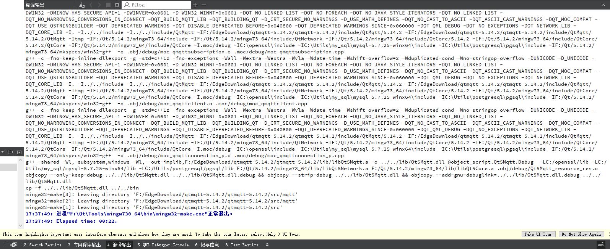

# 说明

## 是什么

人话：Qt是一个软件包，如果你希望使用Qt进行C++的编程开发或者进行图形化开发，而不是VS或VS Code，那么你会下载好大一推软件，并且它们都以Qt为前缀，甚至对于第一次上手的新手来说，你可能连使用哪个版本都搞不明白。Qt Creator是Qt的核心一样的东西，我们可以用它敲代码，编译、设计图形化界面，这个过程就可以叫做用Qt进行开发。

官话：Qt 是一款跨平台的应用程序开发框架，用于开发具有图形用户界面（GUI）和非图形用户界面（非 GUI）的应用程序。Qt 成立于 1991 年，是由挪威公司 Trolltech 创立的。1996 年，Qt 进入商业领域，并成为全球众多成功应用程序的基础。目前，Qt 属于诺基亚公司。Qt 是一个面向对象的框架，支持多种编程语言，如 C++、Python 等。它提供了丰富的功能，包括界面元素、数据存储、网络通信等，以帮助开发者轻松构建跨平台的应用程序。Qt 有专业版本和企业版本，适用于不同的开发需求。此外，Qt 还为移动设备提供了 Qt Mobile 版，用于开发手机、平板等移动设备的应用程序。

唠叨：我第一次听说Qt这个东西是在一门工程实践课程上，由舍友给我灌输的概念，当时我就以为Qt无非是一个用来画GUI界面和设计GUI软件的图形软件设计器，真正使用Qt就是在这一次比赛中，我没多余的时间再去找一本Qt教材慢慢入门，直接紧急上手，紧急上手了三个月之后终于用qmake完成了交叉编译的工作，对于Qt是什么，我想我的回答不是很合格，但我已经非常尽力去用我的认知表达我的见解和直接感受了，至于深入使用之后，对Qt的认知是否会发生根本上的改变，我想这是十分值得期待的事情。

## 怎么做

人话：这是一个比较复杂的过程，且听我长话短说

### Windows安装Qt 5.14.2

清华镜像源：```https://mirrors.tuna.tsinghua.edu.cn/qt/official_releases/qt/```，打开任意版本的QT的offline_readme.txt可看到内容如下（我打开5.15.0）：

```latex
Due to The Qt Company offering changes, open source offline installers are not available any more since Qt 5.15. Read more about offering changes in the https://www.qt.io/blog/qt-offering-changes-2020 blog.

If you need offline installers, please consider our new Qt for Small Business offering: https://www.qt.io/blog/available-now-qt-for-small-businesses
```

可看到自5.15版本起，开源的离线安装已经不支持了，那么为了方便开发就选择5.14的最新版本。（如下载更高版本，则得考虑可能会有付费问题和自行编译Qt creator问题）

QT官网下载地址：[Index of /archive/qt](https://download.qt.io/archive/qt/)，选择官网的理由有：镜像源版本可能不够多。如果镜像源的版本支持你的需求，你可以选择更加快速的下载源，这里只说官网的选择方式。

进入上述链接之后可看到众多QT的版本，依次点击5.14/，5.14.2/，可以看到windows下的可执行文件，下载得到可执行文件```qt-opensource-windows-x86-5.14.2.exe```，大小为2.28GB，下载时间较长，下载完成之后安装即可，需要注意的是qt的安装需要选择很多编译器版本等选项问题，其中的版本取舍问题需自行了解，根据项目需求、教程指引、硬盘空间等因素决定，一般来说任何编译器都可以编译出文件，这里推荐最好是全部安装以防需要重装。QT的入门问题可参考其他书籍或网络教程。

安装完成之后可以看到QT众多的组成部分，如Assistant、Designer、Linguist、Qt Creator，其中除了Qt creator为4.11.1(Community)是唯一的，其余组成皆为一个编译器版本对应一个可执行文件，安装的编译器越多，可执行文件就越多，版本都为5.14.2。

此时视为Qt已完成安装，如未安装完成，以下内容可不用继续了解。

#### 编译QMqtt动态链接库（dll文件）

Github仓库链接：[qt/qtmqtt: Qt Module to implement MQTT protocol version 3.1 and 3.1.1](https://github.com/qt/qtmqtt)，打开之后不急着下载，选择与Qt对应的版本。仓库内把dev分支调整为5.14.2后再下载，最好使用git或github desktop下载该仓库，以保证文件完整和完好性，直接下载ZIP压缩包可能存在一些问题。

下载完成后可用Qt Creator打开qtmqtt.pro文件，在Qt界面内可以看到examples、src、tests目录，src目录下有src.pro、mqtt目录，mqtt目录下有mqtt.pro、Headers、Sources、Other files目录，该内容为我们需要编译为动态链接库的内容。

点击Qt界面左侧的**项目**，配置如图。


图中首先需要取消勾选Shadow build，编译器版本可随意选择MinGW 64-bit或32-bit，图中选择64-bit，编译对象在左下角选择为Debug和qtmqtt_pub，点击第带Debug的运行按钮，一般Qt会自动打开编译输出窗口，如未打开，可自行打开**4 编译输出**，拉高编译输出的窗口，如果编译正常可看到下图内容。



此处编译时长为22秒，同时会打开一个cmd窗口，直接关闭即可。

打开windows的文件管理器，找到该Github仓库的本地路径（```F:\xxx\qtmqtt-5.14.2\qtmqtt-5.14.2```）

1. 复制lib文件下的.a文件和.prl文件到编译器的lib中（编译器路径通常为Qt安装路径），例如此处把两个文件放到```Qt\5.14.2\mingw73_64```的lib下；
2. 把.dll文件复制到编译器的bin路径下；
3. 把lib/cmake下的文件夹也复制到编译器的lib/cmake路径下；
4. 把mkspecs下的.pri文件也拷贝到编译器，如不存在对应的文件夹，可自己新建或直接把文件夹复制过去，命名不变即可；
5. 把include下的QtMqtt也复制到编译器的include目录下

结束编译QtMqtt的动态链接库，此时应可以在Qt中使用mqtt的库。

#### 编写mqtt和socket客户端

在Qt Creator中选择**文件-New File or Project-Application-Qt Widgets Application**，点击choose后给项目命名，路径可以新开一个工作路径，选择好之后会出现**创建路径/名称/x.pro**等路径，**下一步**，qmake即可，Class name最好默认为MainWindow，常见的项目会采用该命名，熟练者可自己独立命名，故该界面可直接点击下一步，Translation File默认不变即可，Kits需选择已经复制粘贴过QtMqtt等相关编译文件的编译器，同时也可以包含其他版本的编译器，但是其他编译器不能使用mqtt，Summary直接点击完成即可。

得到如图所示界面：


想要使用mqtt或者其他库，需要修改类似makefile一样的文件，Qt中也即.pro文件，双击该文件后在```QT+=core gui```后补充network和mqtt（灵活补充空格）即可。

然后在mainwindow.h中```#include<QtMqtt/qmqttclient.h>```等头文件即可，此处存在不同版本的mqtt有大小写的区别和路径的区别，会引起报错，可按照之前编译动态链接库的时候的路径查看响应的路径和文件大小写情况，保证不会报错即可。

关于如何编写mqtt客户端的问题，可参考官方仓库[qt/qtmqtt: Qt Module to implement MQTT protocol version 3.1 and 3.1.1 http://mqtt.org/ (github.com)](https://github.com/qt/qtmqtt/tree/dev)下的路径```/examples/mqtt/```下的众多项目，该仓库之前编译mqtt的动态链接库时已下载了5.14.2的版本，链接会跳转至最新branch，或者参考好心人仓库[DanielLiMing/QtMqttClient: 使用QT创建的mqtt客户端，可用于mqtt的调试 (github.com)](https://github.com/DanielLiMing/QtMqttClient)等方式快速编写MQTT的客户端，好心人仓库内没有实现读取上行数据的反馈的部分，还是会依靠官方的example中的代码。


关于MQTT的说明参考本仓库链接：[关于MQTT](../../额外说明/关于MQTT/Readme.md)。

Socket的客户端相对于MQTT会简单很多，主要使用Qt自带的QTcpSocket库。


关于TCP Socket通信的说明参考本仓库链接：[关于Socket](../../额外说明/关于Socket/Readme.md)。

### 树莓派安装Qt5.11.3

安装树莓派系统： 手动安装较老版本的raspbian，相关原因在Q&A中有陈述，镜像获取地址[Index of /raspbian_full/images (raspberrypi.org)](https://downloads.raspberrypi.org/raspbian_full/images/)，此处选择raspbian_full-2020-02-14下的zip文件，下载后解压得到.img文件，烧录软件获取地址[树莓派资源下载 | 树莓派实验室 (nxez.com)](https://shumeipai.nxez.com/download#tools)，需要下载Win32DiskImager，SD卡的格式化可以先在windows的磁盘管理中删除卷然后格式化为NTFS格式（经测试FAT32无法烧写镜像），若SD卡因提前烧写树莓派镜像导致写权限问题无法删除卷，可通过更换PC尝试删除卷，或使用SD卡格式化工具，链接同上烧录软件。

烧写系统到SD卡后可在boot目录下配置ssh和wifi密码，但可能会出现wifi配置失败的情况，因此最好提前准备好一台显示屏和microHDMI的转换头，以及一套键鼠，树莓派4B有两个microHDMI，文档作者的接口只有靠近Type-c的接口可以正常使用，靠近3.5毫米耳机孔的接口无法使用。

在接入显示屏的情况下按照开机指引配置完树莓派系统，启动VNC功能，参考网络教程[VNC连接树莓派](https://blog.csdn.net/xia0_ba1/article/details/81746607)，配置完成后可通过VNC Viewer免费软件连接到树莓派的桌面，从此以后无需给树莓派连接显示屏。

进入系统后先修改树莓派的中国软件源，可用源可参考[Raspberry Pi OS 中国软件源 | 树莓派实验室 (nxez.com)](https://shumeipai.nxez.com/2013/08/31/raspbian-chinese-software-source.html)，格式可跟随系统默认格式，只需更换网络地址，本次使用的版本为buster，最新的bullseye软件不齐全。详细教程参考[树莓派 apt-get 换清华源](https://blog.csdn.net/u014663232/article/details/105599521)。

```shell
#软件更新源/etc/apt/sources.list
deb http://mirrors.tsinghua.edu.cn/raspbian/raspbian "Codename" main contrib non-free rpi
deb-src http://mirrors.tsinghua.edu.cn/raspbian/raspbian "Codename" main contrib non-free rpi
deb http://mirrors.ustc.edu.cn/raspbian/raspbian "Codename" main contrib non-free rpi
deb-src http://mirrors.ustc.edu.cn/raspbian/raspbian "Codename" main contrib non-free rpi
#系统更新源/etc/apt/sources.list.d/raspi.list
deb http://mirrors.tsinghua.edu.cn/raspberrypi "Codename" main
deb-src http://mirrors.tsinghua.edu.cn/raspberrypi "Codename" main
deb http://mirrors.ustc.edu.cn/raspberrypi "Codename" main
deb-src http://mirrors.ustc.edu.cn/raspberrypi "Codename" main

#补充说明："Codename"可以直接在对应文件的默认源中查看，可以无需额外通过lsb_release -a查看
```

修改两个文件之后执行更新

```shell
sudo apt-get update
sudo apt-get upgrade
```

然后安装qt需要的组件，相关组件可参考[Qt5开发问题汇总](https://www.jianshu.com/p/465bd00aa5dc)，此处给出部分安装：

```shell
sudo apt-get install qt5-default
sudo apt-get install qtcreator
#以上为基本组件，必要，以下为之后编译qmqtt源码需要
sudo apt-get install qtdeclarative5-dev
#以下根据个人情况安装
sudo apt-get install qtbase5-examples
```

根据前文可知，qmqtt的编译最好选择与qt版本相对应的版本，登录VNC，打开qt图形化界面，tools-Kits-Qt Versions可查看到Qt版本，下载最接近的mqtt版本即可，此处树莓派安装的qt为5.11.3版本，mqtt仓库内仅有5.11.2版本，无.3，故下载.2版本进行编译。

下载源码之后打开src目录下的src.pro工程文件，注意在Projects中去除shadow build，编译思路与windows平台近似，通常会遇到**无法找到头文件xxx.h头文件**的问题，修改#include格式即可，例如#include<QtMqtt/qmqttglobal.h>出错，就#include<qmqttglobal.h>，如果还出错，就```#include"qmqttglobal.h"```，相关问题为C和C++语言问题，不是QT的问题。

编译之后找到编译目录下的include、lib、mqtt文件夹，新建qt工程，将三个文件夹全部复制到qt工程中，与main.c文件同级，重新打开工程。qt自动读入mqtt和include，添加lib需要右键工程文件夹-Add Library-External library-Library file选择lib下的libQt5Mqtt.so即可，其他选项默认，结果可在qt项目中看到Other files目录下有lib文件夹。

注意此时无需在.pro中添加mqtt，直接在```mainwindow.h```中```#include<mqtt/qmqttclient.h>```即可。

此时build或run项目可能会报错main.o重定义，或private/xxx.h找不到，或者其他因上述两个问题导致的错误，解决方法参考Q&A。

完成树莓派平台的MQTT环境搭建。

#### 树莓派交叉编译环境配置

可以看到windows和树莓派的qt版本不同，并且在选择mqtt版本时也存在没有与qt版本对应的mqtt版本，所以需要考虑交叉编译树莓派的qt（树莓派本地编译会得到至少4GB的文件夹、超长的编译时间以及树莓派的高温运行）

1. 准备虚拟机：可以使用虚拟机软件VMware创建虚拟机，推荐使用Ubuntu的镜像，镜像下载地址[Ubuntu 18.04.6 LTS (Bionic Beaver)](https://releases.ubuntu.com/18.04.6/)，推荐使用旧版```Ubuntu 18.04.6 LTS Bionic Beaver```，最新版为```Ubuntu 22.04.2 LTS Jammy Jellyfish```，相关原因已在上文说明，与树莓派系统版本类似；安装教程可参考网络资源[VMware虚拟机安装Ubuntu](https://blog.csdn.net/qq_43374681/article/details/129248167)，值得注意的是虚拟机硬盘大小最好大于40GB，其他配置可按照把自己的电脑硬件资源对半分给虚拟机（仅推荐与建议）。

2. 系统刚安装完成时，保持DVD选择从镜像启动，再从新进入系统，会发现桌面上有VMware Tools，打开后发现tar压缩包，复制到桌面上，启动终端然后tar -zxvf解压，进入文件夹，```sudo ./vmware-install.pl```，过程中需要多次输入yes和默认路径，请详细阅读相关英文说明，否则reboot之后vmware-tools也不会生效。该软件用于实现从宿主机到虚拟机的文件传输功能，可以避免之后再搭建FTP服务器。

3. 配置系统软件下载源：点击系统左下角菜单，打开软件更新器时会进入超长时间的更新过程，更新完之后再打开，系统会推荐可更新Ubuntu到20的版本，不要点击升级即可，点击左侧设置，自动配置最合适的服务器，例如本文被识别为```cloud.tencent.com```最合适，就配置为该服务器即可，配置完之后还没完；安装vim编辑器后打开```/etc/apt/source.list```，可以看到只配置了一堆deb，而没有配置deb-src，该问题会在之后配置Qt编译依赖的时候被提醒，故建议先配置完成，方式会将deb全行复制到下方，把deb补充为deb-src即可，内容较多，与树莓派的一个服务器只有两行（deb和deb-src）不同，请多加小心，不要抄写错误，不要随意删减注释内容；

4. 配置Qt编译环境：Qt编译依赖环境参考官方指定文档[Building Qt 5 from Git - Qt Wiki](https://wiki.qt.io/Building_Qt_5_from_Git)，主要包括Linux/X11下除```Convenience packages```以外的所有内容，第一项为```bulid-dep```，最后一项为```QDoc Documentation Generator Tool```

5. 准备编译材料：①qt源码，此处仍然选择最后一个可以直接在windows离线安装的qt5.14.2版本；②树莓派交叉编译工具链，资源获取地址[Linaro Releases](http://releases.linaro.org/components/toolchain/binaries/7.5-2019.12/arm-linux-gnueabihf/)，下载其中的```gcc-linaro-7.5.0-2019.12-x86_64_arm-linux-gnueabihf.tar.xz```、```runtime-gcc-linaro-7.5.0-2019.12-arm-linux-gnueabihf.tar.xz```、```sysroot-glibc-linaro-2.25-2019.12-arm-linux-gnueabihf.tar.xz```三个压缩包，下载完成之后三个压缩包可能格式会由tar.xz变为tar.tar，重命名为tar.xz即可传输到Ubuntu中正常解压；解压方式为```sudo tar -xvf qt.tar.xz```，使用-zxvf的方式可能无法使用Tab自动补全，故使用-xvf；如仍无法自动补全，可考虑使用```sudo chmod 777 qt.tar.xz```给文件权限；解压完成之后把三个文件夹合成一个文件夹，建议把sysroot、runtime里边的文件夹都复制到gcc中，即合并bin、lib等文件夹即可，之后带着gcc的整个包到处复制就行了。

6. 在Ubuntu上安装Qt5.14.2：下载.run文件链接[Index of /archive/qt/5.14/5.14.2](https://download.qt.io/archive/qt/5.14/5.14.2/)，如遇下载缓慢问题可考虑用windows下载、浏览器改为迅雷下载；安装过程中可将虚拟机断开网络连接，防止Qt安装包要求登录；安装时全部勾选即可；安装完成之后本文遇到了qtcreator无法从命令行启动的问题，直接从图形化界面打开```/opt/Qt5.14.2/Tools/QtCreator/bin```，运行qtcreator即可打开IDE；此时可使用x86平台的Kit、qmake、gcc编译出可执行文件

7. 参考网络链接：[为树莓派4交叉编译QT5.14.2（带EGLFS支持）](https://zhuanlan.zhihu.com/p/138021025)，大致流程为：更新树莓派，更新X86主机上的环境，通过树莓派配置X86主机上的sysroot，生成qtbase的qmake。

   - 交叉编译的要求就是，在主机和目标机上都存在目标机的环境，在主机上存在交叉编译的环境
   - Qt交叉编译的要求参考Qt官方文档的说明：[Configure an Embedded Linux Device | Qt 6.5](https://doc.qt.io/qt-6/configure-linux-device.html)，这里有说明为什么要配置toolchain和sysroot
   - 网络教程缺失的py文件可以直接在github搜索文件名，然后会有人保存改文件的
   - 我多次跟了这个教程，目前为止都是没有再继续出问题的，如出任何问题，请重装树莓派系统、删除已配置的qt-everywhere-src，然后再严格按照教程来做
   - 最后会在/home/host-name/raspi/qt5pi/bin中发现qmake文件，该文件为核心文件，不过之后都需要带着整个raspi文件夹走到任何地方了。

8. 获得qmake之后，之后所有的操作都是：

   - `cd qt-everywhere-src/other qt module`
   - ``/home/host-name/raspi/qt5pi-host/bin/qmake``
   - ``sudo make -j32``
   - ``sudo make install``

   然后再同步到树莓派上去

   - ``rsync -avz /home/host-name/raspi/qt5pi pi@192.168.1.x:/usr/local``

   同步到树莓派的原因很简单，编译qt的各个模块都会获得相关的.so文件，类似于.lib文件那样，仅需要库文件和头文件就能使用函数了，不需要.c源文件了

9. 后边配置qt creator的kits可以继续跟着教程走，需要注意的一个东西是Device可以不用配置key，对我来说，我随时可能把系统洗的一干二净，配key反而麻烦了，输密码就行了，把key的设置改为default就行了


### 龙芯派二代系统配置

1. 制作启动盘：使用镜像版本为```Loongnix-Embedded-20.1.rc2-loongarch64-DVD-1.iso```为2023年嵌入式比赛中上传到比赛QQ群的文件，与qq群中的手册说明的镜像不同，但启动盘制作方法与教程相同，可参考群文件**龙芯派二代用户手册_V1.4.1.pdf-5.1.2 安装Loongnix系统**章节内容
2. 安装Loongnix系统：将U盘和键盘插入龙芯派二代仅有的两个USB接口，不急着上电，龙芯派二代没有默认自带wifi，故可通过一根以太网线将龙芯派二代的eth0（靠近hdmi）与电脑以太网口连接，通过PC的wifi网卡共享网络到以太网口，可实现安装阶段接入网络；插入HDMI接口，等待显示屏亮起；第一项为选择中文安装，并且之后全为中文系统，配置内容主要包括全不硬盘安装系统、唯一root分区、主机名（hostname：默认debian）、root密码、用户账户名及密码、服务器域名（.cn等结尾，可随意设置）、网络安装镜像（默认填入mirror，不选择）、选择安装ssh+桌面+mate等软件（重点中的重点，所有软件通过空格选中，选择阶段按下enter键将开始安装，如未配置完成则需要等待安装完成后从头开始，耗时极长），最后会提示拔掉启动盘，在该界面拔出u盘后enter继续即可进入loongnix系统
3. 设置软件源：先```su```进入超级用户，```vim /etc/apt/source.list```，只添加deb，内容为```http://pkg.loongnix.cn/loongnix```，其余保持与文件相同，然后```apt-get update```和```apt-get upgrade```，时间较长，完成之后```apt-get install aptitude```，准备使用aptitude解决安装依赖问题
4. 配置SSH：安装系统阶段已安装ssh，先```su```进入超级用户，```vim /etc/ssh/sshd_config```，取消注释以下内容

```shell
Port=22
Protocol 2
ListenAddress 0.0.0.0
PermitRootLogin yes
PermitEmptyPasswords no
PasswordAuthentication yes
```

与官方提供的书籍资料《用”芯“探核 龙芯派开发实战》不同，需要通过以下命令配置ssh：```systemctl enable ssh```完成开机自启的配置，```systemctl start  ssh```完成ssh启动，注意不能输入Systemctl；Windows通过共享网络会构建一个192.168.137.x的局域网，子网掩码为255.255.255.0，网关为192.168.137.1，通过```sudo ifconfig```查看龙芯派IP地址，因/bin下没有ifconfig，故sudo为必须内容；查询到ip地址后在PC端配置ssh连接即可成功通过ssh接入龙芯派，根据测试，关闭windows或重启龙芯派都不会改变该192.168.137.x的IP地址，无需考虑DHCP的问题

5. 配置VNC：参考树莓派配置VNC以及网络教程[Loongnix-server中vncserver服务使用方法](https://blog.csdn.net/qq_25650463/article/details/126674494)、[龙芯3A4000 vnc远程连接龙芯机](https://blog.csdn.net/a1171936767/article/details/104032863)、[TigerVNC安装使用](https://blog.csdn.net/dvd_sun/article/details/124531184)，进行以下操作

```shell
aptitude install tigervnc-standalone-server
#无需viewer
passwd
#设置一个密码即可，观看密码可不设置

#此处可配置/home/username/.vnc/xstartup文件，配置方法可参考上文提及的链接，个人感觉不需要

vncserver -localhost no :2
#使用netstat -ntlp|grep vnc可得到0.0.0.0:5902，如果没有-localhost no就会出现127.0.0.1:5902，可参考netstat -ntlp|grep ssh得到的0.0.0.0:5902，如果为127.0.0.1是无法被外部设备访问的
```

使用windows端的VNCviewer即可登录到龙芯桌面，但只是理论上可以，此处仍会报两个错，第二个错为```could not acquire name on session bus```，参考网络教程[终于明白vnc登录后could not acquire name on session bus错误的原因了](https://blog.csdn.net/weixin_30821731/article/details/98097697)中的红字可知，需要龙芯注销桌面端，此处我为了防止把系统弄崩溃，选择重启后不输入登录密码，然后在Windows端通过ssh登录到龙芯派，```vncserver -localhost no :2```，IP输入```192.168.137.159:5902```，然后输入自己设置的密码即可打开一个带有一定程度失真的远程桌面，此时已经可以拔掉龙芯派上的HDMI接口了。另外给出关闭vnc服务端的命令```vncserver -kill :2```;

#### 龙芯派二代交叉编译环境配置

安装虚拟机请参考树莓派配置部分。

1. 交叉编译工具链测试：于虚拟机中使用``loongarch64-gcc``工具链编译出可执行文件，上传到龙芯派中，本次测试hello world，结果如图，交叉编译结果在虚拟机内无法运行；在龙芯派二代中可顺利运行


2. 交叉编译Qt项目：根据比赛官方群中的脚本文件``poky-glibc-x86_64-my-qt5-image-loongarch64-ls3a5000-toolchain-3.3+snapshot.sh``文件，执行该脚本文件，可在``/opt``路径下得到``loongarch64-linux-gnu-2021-12-10-vector``文件夹，在``/opt/loongarch64-linux-gnu-2021-12-10-vector/loongarch64-linux-gnu``下可看到sysroot，说明使用方法与树莓派类似，此处我仅补充一点，把loongarch的交叉编译套件配置到qt tools中、kits中时，通过图形化界面存在无法编译通过的情况，此时参考[龙芯2k1000LA平台：Qt与文件编译配置](https://www.bilibili.com/video/BV1Ge4y197gk/?spm_id_from=333.999.0.0&vd_source=eb5f24bfe098bea8c8c9297b89e1bd81)教程最后一分钟内的字符终端编译方法即可，我是这样编译成功的，因为我用Linux上的Desktop Kits编译是没问题的，但是换到loongarch的kits就出错，那一定是kits的问题，这里通过terminal解决了。其余问题可参考**补充**。

官话：[Qt 5.15](https://doc.qt.io/qt-5/index.html)官话只有官网和无尽且看似无用的文档，各位有需自取

唠叨：整个过程非常非常非常曲折，尤其是给龙芯派配置交叉编译环境，那个官方人员还不如人工zhizhang（狗头保命），反正按照官方的教程来做的话，玩不了一点，整个群里的工具都是属于那种什么呢，”工具在这，你会用就用，不会用就算了吧，这比赛也不指望你们做什么东西出来，反正我们也很随便，教程？我临时给你们找一点放群文档里装装样子得了，你们看得懂那也真是奇才了，真是辛苦我了，今天又在群里和大家说了一天‘请你百度’呢，我要回去休息啦~“，我纯纯是靠树莓派启发得到的龙芯派二代的交叉编译方法，三个月没成功过一次，提交报告的前两天出的结果，半夜在阳台悄悄哭，怕吵到睡觉的室友而已。我也不怕说出来被大家笑话，亲身体验这种一个人在黑暗的地方不断摸索，终于完完全全靠自己把整个解决问题的方法摸索清楚之后，完成了一个阶段性的任务，觉得好笑的尽可以笑，我对这种事真的没有半点忍受不了，只是觉得能体验到这种喜极而泣的感觉的人只我。

## 补充

### 树莓派

- 树莓派上电后电源指示灯红灯亮起（电源指示），绿灯没亮（无网络连接），显示屏仅亮起raspberry pi os后就黑屏了——原因一般为采用电脑USB接口供电，电压保持为5V，电流过小，无法保证树莓派和显示屏的供电功率，将电源换为插头后再启动系统即可电量

- 更换清华源之后，按照网络参考教程安装qt5-default报错：```E:软件包qt5-default没有可安装候选```，可使用```sudo apt-cache search qt```搜索相关的包，一般会有其他可替代安装包，此处给出解决方案一：```sudo apt-get install qtbase5-dev qtchooser qt5-qmake qtbase5-dev-tool```

- 从linux端连接FTP服务器：

  1. 在树莓派terminal内输入```sudo apt-get -y install ftp```安装ftp指令。
  2. 按照以下方式从FTP服务器下载源码文件：

  ```bash
  ftp 192.168.1.x(FTP服务器IP)
  (输入)get qt-everywhere-src-5.14.2.tar.xz
  ```

  可以接收到```local:xxx remote:xxx```，```200 PORT comand successful```，```150 Opening ASCII mode data connection```等响应信息，然后开始无进度条等待传送完成，当传输完成时可接收到响应信息：

  ```bash
  WARNING! 2127496 bare linefeeds received in ASCII mode
  File may not have transferred correctly.
  226 Transfer complete.
  549205340 bytes received in 211.19 secs (2.4801 MB/s)
  ```

  3. 输入```bye```可退出ftp连接。

  源码大小为523.7MB，磁盘上的大小为523.8MB，可以看到传输已经出错，在使用tar解压时会解压失败，此时可考虑把linux端配置为FTP服务器。

- 把linux配置为FTP服务器：网络教程[树莓派文件上传和下载，详细步骤设置FTP服务器](https://www.labno3.com/2021/08/15/how-to-setup-ftp-on-the-raspberry-pi/)

- 安装最新版树莓派系统可能会出现的问题：采用网络教程[RaspBerry Pi 4 Model B树莓派 4b 安装教程](https://blog.csdn.net/weixin_44778012/article/details/115420337)会获取到最新版本的树莓派系统，截止20230707树莓派官方最新版本为bullseye，已经不是buster，当为bullseye重新配置镜像源时会出现qt5-default无法安装，但是qtcreator能安装的问题，结果会导致创建新工程时没有编译器，因此需要自行重新安装buster版本。

- 针对```private/xxx.h```找不到：.pro文件中QT+=core-private即可

- 针对```main.c重定义```问题：.pro文件中可能有多个main.cpp的+=，去除后边的重复项即可

### 龙芯派二代

- 从龙芯桌面进入字符终端：```ctrl+alt+f2```，需注意```ctrl+alt+f1```是无法回到桌面端的，需重启龙芯派，```sudo reboot```

- LA64工具链按照QQ群内文档**使用龙芯派开发一个小游戏.pdf**内1.3.3章节教程进行配置，除QMAKE_CFLAGS两个未知参数外全部修改为```loongarch64-linux-gnu-*```，configure配置为```sudo ./configure -prefix /home/fakeend/qt_5_14_2 -opensource -confirm-license -no-opengl -xplatform qws/linux-mips-g++```，结果报错为```The target system byte order could not be detected!```；修改QMAKE_CFLAGS两个参数为loongarch64之后仍报相同错误，报错情况如图所示

  

  

- LA64工具链直接使用qt-src-5.14.2源码包自行配置qmake.conf文件，内容如下

  

  执行```./configure -prefix /home/fakeend/qt_5_14_2 -opensource -confirm-license -no-opengl -xplatform loongarch64-linux-gnu-g++```得到```Makefile```，显示内容如下

  

  

  提示可以进行make，于是执行```sudo make -j8```，得到报错：```Makefile:50: recipe for target 'sub-src-make_first' failed```

  
  
  上述问题说明该编译流程存在一定的问题，并且qt-src/qtbase/mkspecs/中目前未发现对Loongarch64的支持，连树莓派的编译都可能存在问题的话，资料更少的龙芯派只会更难，所以想在短时间内自行编译一个Loongnix的交叉编译工具（任意版本）是不太现实的。

## 错误信息

### 过去尝试编译qmake的方法

1. 用工具链编译交叉编译所需的qmake：要求①存在路径```/opt/qt-everywhere-src-5.14.2```，如还未cp解压包到opt路径，可使用```cp -r xxx xxx```搬移文件夹；要求②在terminal内输入arm后连续按两下Tab应当出现相关工具链，否则需要添加工具链到环境变量，流程包含：

   - 存在路径```/opt/gcc-linaro-7.5.0-2019.12-x86_64_arm-linux-gnueabihf```，然后```sudo vim /etc/bash.bashrc```，在文件最后行```fi```下方填写内容：
     1. ```export QTDIR=/opt/Qt5.14.2/5.14.2/gcc_64``````
     2. ``````export PATH=$QTDIR/bin:/opt/Qt5.14.2/Tools/QtCreator/bin:$PATH```
     3. export LD_LIBRARY_PATH=$QTDIR/lib:$LD_LIBRARY_PATH
     4. ```export PATH=$PATH:/opt/gcc-linaro-7.5.0-2019.12-x86_64_arm-linux-gnueabihf/bin```

   然后保存退出，执行```source /etc/profile```，可以完成arm后接两次Tab出现工具链

   - 修改```/opt/qt-everywhere-src-5.14.2/qtbase/mkspecs/linux-arm-gnueabi-g++/qmake.conf```，修改内容包括：
     1. ```QMAKE_CC=arm-linux-gnueabihf-gcc```，原内容为```QMAKE_CC=arm-linux-gnueabi-gcc```，以下同理
     2. ```QMAKE_CXX=arm-linux-gnueabihf-g++``````
     3. ``````QMAKE_LINK```
     4. QMAKE_LINK_SHLIB
     5. ```QMAKE_AR``````
     6. ``````QMAKE_OBJCOPY```
     7. QMAKE_NM
     8. ```QMAKE_STRIP```
   - 在```/opt/qt-everywhere-src-5.14.2```下运行指令：
     1. ```sudo mkdir install```
     2. ```./configure -prefix /opt/qt-everywhere-src-5.14.2/install -opensource -confirm-license -no-opengl -xplatform linux-arm-gnueabi-g++```，其中install为qmake生成路径，-no-opengl指定不编译OpenGL库，默认编译的话会给出报错内容：```ERROR:The OpenGL functionality tests failed!```；如果遇到报错：‘找不到g++’，可以给qmake.conf上的g++都修改为绝对路径，麻烦了一点而已，我也不知道为什么添加了路径还没被检测到。
     3. ```sudo make -j4```，此处指明4个并行编译的任务数，一般为核心数的2倍，例如新建虚拟机时选择处理器数量为4，每个处理器的内核数量为1，总数为4，可指定-j8比较合适
     4. ```sudo make install```，如果采用```sudo make -j4&&sudo make install```可能无法在install路径下找到qmake，可单独分开执行
        - 如果```make -j4```时遇到其他问题，可自行搜索网络资源解决，本文未遇到其他问题。
        - 在```/opt/qt-everywhere-src-5.14.2/install/bin```下获得qmake文件

2. 在qtcreator内配置交叉编译环境：Tools-Options-Kits，

   - 编译器内手动（Manual）添加（add）GCC-C，名称自拟，本文为```GCC(arm-linux-gnueabihf-gcc)```，路径为```/opt/gcc-linaro-7.5.0-2019.12-x86_64_arm-linux-gnueabihf/bin/arm-linux-gnueabihf-cpp```，注意是cpp不是gcc，手动（Manual）添加（add）GCC-C++，名称自拟，本文为```G++(arm-linux-gnueabihf-g++)```，路径为```/opt/gcc-linaro-7.5.0-2019.12-x86_64_arm-linux-gnueabihf/bin/arm-linux-gnueabihf-c++```，注意是c++不是g++
   - Qt Version内手动（Manual）添加（add）```/opt/qt-everywhere-src-5.14.2/install/bin/qmake```，版本名称自拟，本文为```Qt %{Qt:Version} (install-arm-linux-gnueabihf)```
   - Kit内手动（Manual）添加（add），名称自拟，本文为```arm-linux-gnueabihf```，Compiler中C选择```GCC(arm-linux-gnueabihf-gcc)```，C++选择```G++(arm-linux-gnueabihf-g++)```，```Qt version```选择```Qt 5.14.2(install-arm-linux-gnueabihf)```，其他默认不变

3. 验证编译环境：新建工程-Application-Qt Widgets Application，name和path，qmake，Kit Selection选择为arm-linux-gnueabihf，取消勾选Desktop Qt 5.14.2 GCC 64bit，完成创建；项目-取消shadow build；Debug build方式；点击Debug运行按钮，**3 应用程序输出**窗口输出内容*Debugging starts;&"warning:xxxxxxxxxxx";无法执行二进制文件：可执行文件格式错误;成功;Debugging has finished*；在项目下找到与项目同名的可执行文件，传输到树莓派，```sudo chmod 777 executable_file```，```./executable_file```，可成功运行，完成交叉编译。

上述方法会收到一堆报错信息，基本为qtopenextension找不到什么的，而且整个过程也不是很像龙芯提供的那一套工具一样，其中有些操作可以借鉴，有些操作用不了，放在最后用于汇总探索情况吧。