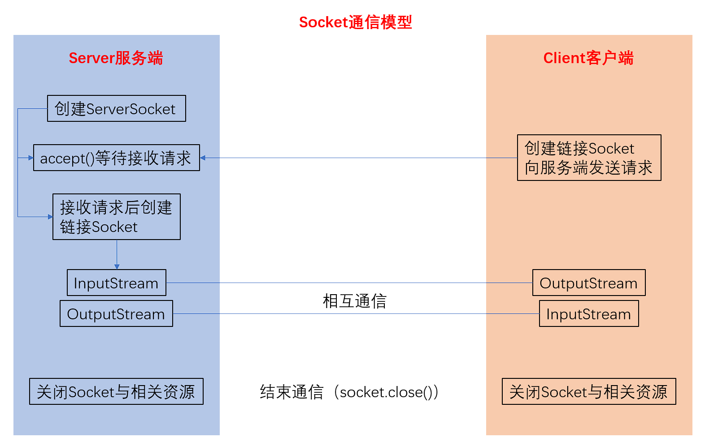

# 说明

## 是什么

人话：可以视为在同一个IP网段下进行通信的一种方式，协议挺成熟的，拿来用就是了，搜索”网络编程“就行了

官话：以下内容参考链接为[基于TCP协议的Socket通信](https://www.runoob.com/w3cnote/android-tutorial-socket1.html)，部分内容为本文档自行补充说明，并非纯原创。

### Socket说明

Socket（套接字）用来描述IP地址和端口，是通信链的句柄，应用程序可以通过Socket向网络发送请求或者应答网络请求。Socket是支持TCP/IP协议的网络通信的基本操作单元，是对网络通信过程中端点的抽象标识，包含了进行网络通信所必须的物种信息：链接所使用的协议，本地主机的IP地址，本地远程的协议端口，远地主机的IP地址，远地进程的协议端口。

### Socket通信模型



Socket通信实现步骤解析：

1. 创建ServerSocket和Socket
2. 打开连接到的Socket的输入/输出流
3. 按照协议对Socket进行读/写操作
4. 关闭输入输出流，以及Socket

### Socket服务端

服务端工作步骤解析：

1. 创建ServerSocket对象，绑定监听的端口
2. 调用accept()方法监听客户端的请求
3. 连接建立后，通过输入流读取客户端发送的请求信息
4. 通过输出流向客户端发送响应信息
5. 关闭相关资源

本文档描述的系统中，Socket服务端建立在ESP-12F单片机上，并且使用Arduino进行开发，故对相关库函数进行进一步解析：

Arduino内主要使用```<ESP8266WiFi.h>```进行配置Socket，代码主要分为两部分：void setup和void loop，其中setup相当于bootloader，loop相当于系统，流程如下：

1. 在函数以外创建ServerSocket对象并绑定端口：```WiFiServer server(PORT)```
2. 在setup中启动：```server.begin()```，等价于调用accept()方法监听客户端的请求
3. 建立连接时```WiFiClient client=server.available()```为真，通过```client.readString()```输入流读取客户端发送的请求信息
4. 通过```client.write()```输出流向客户端发送响应信息
5. 通过```client.stop()```关闭相关资源

### Socket客户端

客户端工作步骤解析：

1. 创建Socket对象，指明需要链接的服务器的地址和端号
2. 连接建立后，通过输出流向服务器发送请求信息
3. 通过输入流获取服务器响应的信息
4. 关闭相关资源

本文档描述的系统中，Socket客户端建立在Linux系统上，并且使用Qt进行开发，故对相关库函数进行进一步解析：

1. 创建Socket对象（在```mainwindow.h```中的```MainWindow```类中定义私有```QTcpSocket```指针变量），指明服务器的地址和端口号（调用Socket对象时使用其```connectToHost```方法指明ip和port）
2. 连接建立后，通过Socket方法```write,flush,waitForBytesWritten```输出流向服务器发送请求信息
3. 通过Socket方法```readLine```输入流获取服务器响应信息
4. 关闭相关资源

唠叨：第一次接触可能比较难看懂配置Socket那套数据的方式，要不断地去尝试，我大二还是大三的时候第一次接触，也搞的很狼狈，那时起我就牢记了一句话”CSDN上没有好人“，意思就是搜索引擎找到的方法都挺没用的，但还是多找多看多学，灵活一点，多试。而我，直接使用以前的代码，不试；不会的自强！

## 怎么做

人话：局域网临时配置方法如下

1. 打开手机设置-个人热点-配置热点安全性为WPA2-Personal，设备标识为移动热点，选择AP频段2.4GHz频段-设置热点名称与密码
2. 将ESP配置连接到手机热点（5G频段不适用）
3. 将上位机连接到手机热点
4. 将龙芯派通过以太网连接到上位机以太网口，将上位机WLAN无线网卡适配器配置为共享网络，共享给龙芯派连接的以太网适配器，在cmd内查询ipconfig，要求以太网适配器下IPv4地址为192.168.137.1，默认网关为空，子网掩码为255.255.255.0，否则请自行尝试其他IP地址
5. 重启龙芯派
6. cmd内执行`for /L %i IN (1,1,254) DO ping -w 2 -n 1 192.168.137.%i`，查找除192.168.137.1以外的响应IP，如果成功在2到254之间找到响应IP，通过ssh客户端连接龙芯派即可，网络配置结束，保持手机热点开启；若无响应，需给龙芯派配置HDMI显示屏检查问题；

官话：《网络编程》.pdf，自己找书

唠叨：多试，加油捏

## 补充

待续