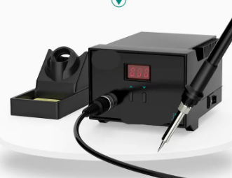
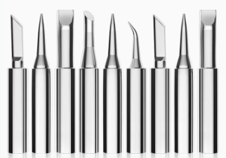
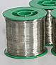
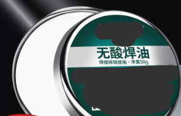
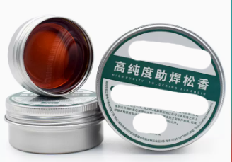
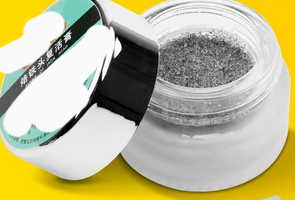
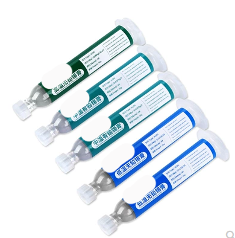
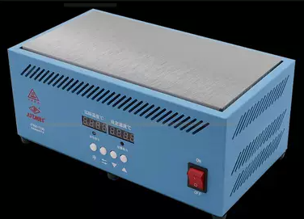
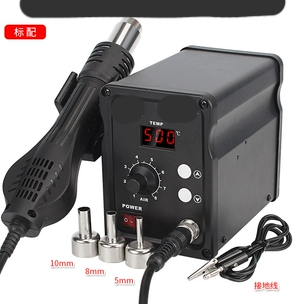
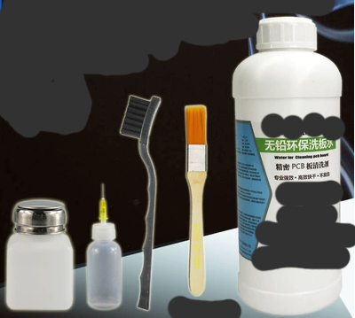

# 本页关键词

- 认识常用仪器与罕见仪器

# 说明

## 是什么

人话：焊接就是利用金属-铜（通常是焊盘）或金属-铁（通常是引脚）和锡丝在高温下非常容易黏在一起的原理去焊接各种元器件，完成电流或者电平的传输，本文旨在给几乎没怎么动手焊接的初学者说明弱电电路板的焊接流程和注意事项，懂哥请移步。

### 电烙铁

以前我们上课使用的是插电就加热的，能不能换烙铁头我没注意，当时根本不懂，后来用的全是这种温度可以自由控制的，烙铁头都能换，一般买来是默认为圆头的好像

### 烙铁头

一般是左二或右二这种，但是从这段时间的上手感觉来看，左一这种刀头是非常非常好用的东西，非常推荐

### 锡丝

熔点一般比较低，白色、亮闪闪的，有质量好坏、氧化程度的问题，好的锡丝和氧化程度低的锡丝比较吸烙铁头、焊盘、引脚。

### 高温海绵

小海绵片，加点水再用就能用很久了。

### 无酸焊油

大佬称之为”猪油膏“，好像是锡上的太多了之后可以上点这个固态油到多锡的位置去锡，我用的不多

### 松香

一般是先把松香翘一小块下来，放在焊盘上，用高温的电烙铁融化它，那么焊盘就更吸锡一点（应该是抗氧化用的吧）。热（高温）知识：小焊盘很难上锡。但用的实际上也少，我有更推荐的，除非各位没更好的条件（狗头）。ps：这玩意很硬，没这么好翘。

### 复活膏

全名应该叫烙铁头复活膏，松香是为了方式焊盘氧化的，复活膏则是给烙铁头去氧化的，所以说烙铁头也有吸锡的能力的区分，氧化比较足（用的久）的烙铁头不太吸锡，那么在给电路板添锡或去锡时都会变得很高血压，所以需要复活膏。

但因为这玩意本身是颗粒状的，所以你是不可能给它夹一点出来放在高温烙铁头上的，直接把高温烙铁头伸进去就行了（反正我是这么用的，为了安全起见建议各位自行搜索用法，这里我要混了）

### 锡膏

它可以和加热台合起来用，就是在得到未焊接但是已经有焊盘、电线的板子之后，把这玩意往焊盘上涂适量，然后把焊盘对应的元器件放上去黏住，然后循环这个过程把所有元器件都黏上板子，然后把板子放在加热台上，过一会锡膏就变成锡并且自动在引脚之间断开，把引脚黏在电路板上了。

购买时会得到未剪开的塑料针头，以及推推棒，把图中的主体下端扭开，上端取开，下端旋进塑料针头，上端插进推推棒，给针头剪一个小孔，就可以开始给电路板涂锡膏了。使用完成之后要取下针头和推推棒，因为针头没封起来，时间久了锡膏是会氧化的，且不说会堵住针头，还会变成无色液体，还不好用，时间越久越不好用，所以需要还原成买来的模样，能密封就密封，反正一般都要使用多次。

### 恒温加热台

这是顶级神器，加热需要一点时间，恒温之后就可以把涂好锡膏、黏好元器件的电路板放上去，过一会锡膏就附着好了，用镊子取下电路板即可，但是这个工具只适合于单面板，多面的不行。通过这个神器，你的焊接只需要再补充一个锡膏，不需要电烙铁、焊油、松香、洗板水，就可以准备收工了。原本焊一天才能完成的工作，这个焊台可以让你一小时完事。

### 热风枪

图中左边那个，仪器上电时就会启动，但是在”卡在座上“时不会吹风，取下时会慢慢起风，吹出高温热风，一般是用于吹松香、吹大芯片（焊盘全在底部、焊盘还很多的那种），但是吹大芯片一般会操作报废吧，那玩意不是能随便取的。

### 洗板水

洗板水好像也叫香蕉水，就是一般的电路板都是不能接触任何一点液体的，但是洗板水可以在不上电时用在电路板上，用于洗除板上的松香（意思就是说，不用加热台时，你需要在电路板全板上涂开松香，焊完之后再用洗板水洗除），然后等电路板干燥之后就能上电了；能不能在存在洗板水时上电这个问题也许有人也很在意，但我就不试了，有心人自强！

### PCB

PCB就是电路板，Printed Circuit board，就是常见的电路板，在加工时会问：是否选择FR4材质、过孔是否盖绿油、板上铜线厚度、是否有印丝、板厚？这些东西，具体问题可参考本仓库链接：[关于立创EDA](../关于立创EDA/Readme.md)

官话：焊接是一种加工方法，通过加热将两个或多个金属工件接合在一起。焊接过程中，工件的局部区域被加热至熔化状态，形成熔池。当熔池冷却凝固后，工件之间便形成了牢固的连接。焊接技术广泛应用于各种金属制品的制造和修复，如钢结构、汽车零部件、电子产品等。焊接可以分为多种类型，如熔焊、压焊和钎焊等。熔焊是最常见的焊接方法，适用于各种金属和合金。压焊主要通过压力使金属工件接合，如冷压焊和热压焊。钎焊则是通过熔化的钎料将工件连接在一起，适用于连接不同材质的金属。在焊接过程中，还需要使用各种焊接符号来表示焊缝的形式、尺寸和焊接要求。焊接符号一般由基本符号、指引线、辅助符号、补充符号和焊缝尺寸符号组成。这些符号在图纸上表示焊缝的形式和尺寸，以便于工人按照要求进行焊接操作。

唠叨：学电子信息的应该会在比较早的大学课程中上和焊接有关的实验课，我以前在大一就上过，当时是去实验中心，自己找一块金属板子，画电路图（用AD），然后打印到那个石墨纸一样的纸上，然后和金属板贴在一起，用一个带滚轮的加热机把石墨印到金属板上（给金属盖住，之后没盖住的地方就会被去除），然后拿到实验楼三楼去泡硫酸铜，泡大约1小时还是多久来着，取出来，然后用砂纸把被石墨盖住而没被硫酸铜腐蚀掉的板级电路线打磨出来，再往上边焊接陶瓷电阻（有色环那种）、开关、大头LED灯，这一次比赛做了好多次板子才觉得当时学校那个教学有点那啥，算了，培养学生嘛，不寒颤。

## 怎么做

人话：简单来说上述的套件建议都要有，恒温加热台+锡膏即可完成第一阶段的焊接任务，如果电路板需要焊接带引脚的元器件，如开关（非贴片）、排母等，就需要再使用电烙铁、锡丝进行处理，当电烙铁不好用时，就会使用复活膏，贴片电阻歪了的时候得用刀头去矫正，PCB温度太高了得用镊子按住板子，没有复活膏的时候可能会选择临时用猪油膏或者松香修一修烙铁头，虽然效果非常非常不好。

官话：无

唠叨：无

## 补充

待续