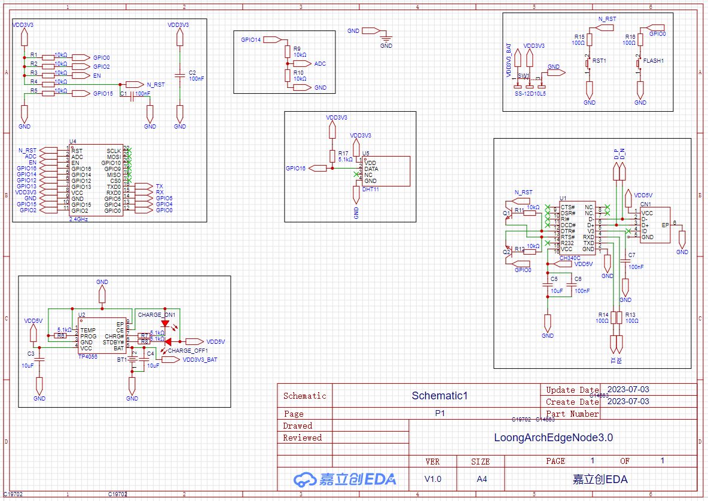

# 本页关键词

- 电路绘制
- 原理图抄袭方式
- 下单打板途径

# 说明

## 是什么

人话：用来画板子的EDA工具，包括原理图和PCB，还能对PCB进行DRC（检查布线是否交叉），能选择放入原理图的元件封装类型很丰富，能放完原理图之后就导出BOM（元件清单）。不能做电路仿真。

官话：嘉立创EDA，超过百万的免费库（超过400万个并且不断新增的元件库，让你更专注于设计，你也可以创建或导入自己常用的元件库和封装库），整合立创商城和嘉立创元器件目录，得益于中国领先的元器件自营商城-立创商城，和中国领先的PCB/SMT制造商-嘉立创，嘉立创EDA集成超过90万实时价格的，实时库存数量的元器件库。电子工程师可以在设计过程中检查元器件的库存、价格、值、规格书和SMT信息，缩短器件选型和项目设计周期。

唠叨：立创EDA真的非常良心了，很多时候都可以领券，白嫖，而且还非常的小白友好，人工审核的态度非常好，服务比较即时，不说1秒回复、审核，我目前打板了8-9次就30分钟最长给我审核的，不卑不亢，职业操守非常好。

## 怎么做

人话：比赛要求不使用市售模块，故本文档会提供对传感器节点的设计、选型、使用说明。

#### PCB设计

本次比赛选用比较热门的物联网无线模块ESP-12F，其对应可参考的资料是ESP8266-NodeMCU开源硬件开发板，可以参考的NodeMCU电路图较多，此处随意选择一个以CH340为烧录芯片的版本。该图为开源内容，来源链接：[NodeMCU-ESP8266](https://docs.ai-thinker.com/esp8266/boards/nodemcu)。

PCB软件采用嘉立创EDA专业版，软件官网为[国产嘉立创EDA](https://pro.lceda.cn/)，使用过程全部免费，可选择在线版或者客户端版，推荐客户端版，同时下载嘉立创下单助手，可免运费下单打板PCB，软件官网为[嘉立创PCB下单助手](https://www.jlc.com/portal/appDownloadsWithConfig.html)。本文档的原理图根据以上开源原理图进行部分修改以符合比赛要求，原理图详情内容如下：

其中ESP-12F根据安信可、乐鑫提供的相关资料，对GPIO0、GPIO2上拉，对GPIO15进行下拉，在GPIO0端设计一个key用于在第一次烧写时锁定FLASH，完成第一次烧写的启动，之后依靠自动烧写电路进行烧写。

充电芯片根据TP4056提供的数据手册中的应用电路进行设计，详情可从立创EDA内跳转到数据手册。

DHT11因其在Arduino中的应用库较为完整，并且只需要一端数据线接入IO口，根据DHT11的数据手册设计图中应用电路。

烧写电路选择CH340C，其余型号可参考该系列芯片的数据手册选型，CH340C具有内置晶振，无需外部晶振，使用外部晶振时请牢记CH340手册中的警告与提示，以防使用错误的电容导致晶振无法顺利起振。其余内容为自动烧写电路。

电量测量电路使用ESP-12F的ADC端口测量模拟值，使用IO14进行测量电路的开关。

#### 元器件选型

电容、电阻的封装只要大致符合贴片电容、电阻的焊盘规格即可，可在某单一型号的元件不足时采购规格近似的元器件，无需担心焊盘过小的问题。

官话：无

唠叨：目前来说我还没完全成功地自制过一块板子，估计是得花点时间了，但之后还会再继续试的，一次打板20块嘛，元器件成本好像是一套70-80？忘了。

## 补充

待续